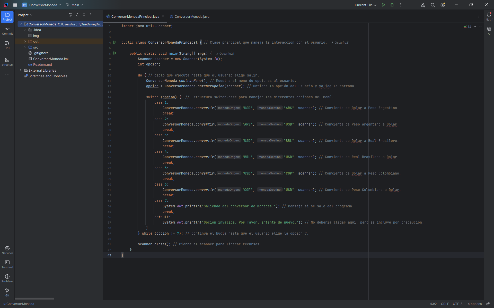

#   

<h1>Challenge Conversor de Monedas

## Descripción General
  El Conversor de monedas es un proyecto de una aplicación en java la cual permite al usuario el cálculo del cambio de Monedas entre Peso Argentino, Real Brasilero y Peso Colombiano con respecto al Dólar.

## Objetivo general
  Realizar un proyecto real de la manera que se realiza en la vida cotidiana de un Desarrollador de Software, con el fin de practicar los conocimientos adquiridos en programación Orientada a Objetos, consumo de una API, manejo de errores y excepciones.

## Ejecución del aplicativo
  Descargado el proyecto en un archivo.zip desde el link de github, descomprime el archivo y colócalo en una carpeta independiente. Una vez lo tengas de esta manera abre la carpeta con IntelliJ IDEA
  Una vez abierto el proyecto abre el archivo ubicado en la carpeta SRC/ConversorMonedaPricipal y ejecútalo haciendo clic en el símbolo de play o con Mayúsc + F10.
 

## Instrucciones de Uso
  Una vez la aplicación corre en la consola se debe seleccionar el número correspondiente a la opción deseada, el pedirá la cantidad de la moneda a convertir y te dará el valor de la moneda correspondiente a la conversión deseada, puedes continuar o salir digitando la opción 7.

## Tecnologías utilizadas:
- **Java**: La columna vertebral de la aplicación, encargada de la lógica y otras funcionalidades.

## Requisitos
	Java 17 o superior
    IntelliJ IDEA (Community Edition es suficiente).
	
## Licencia
Este proyecto se distribuye bajo la licencia MIT. Puedes usarlo, modificarlo y compartirlo con libertad
